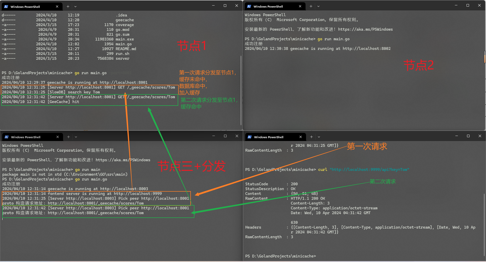
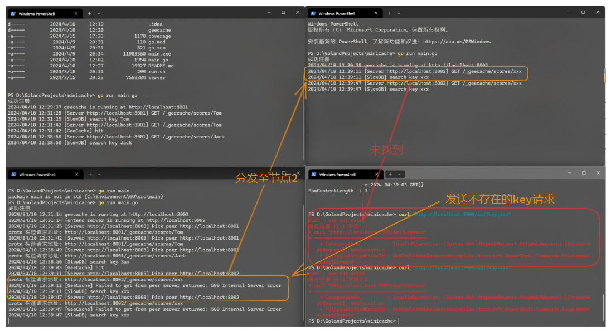
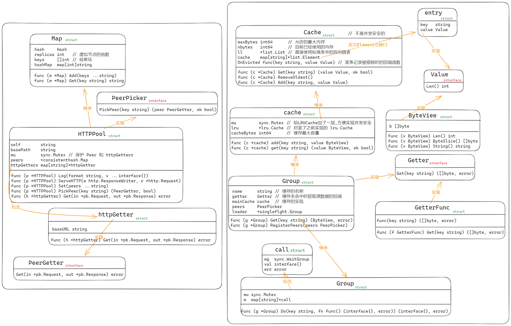
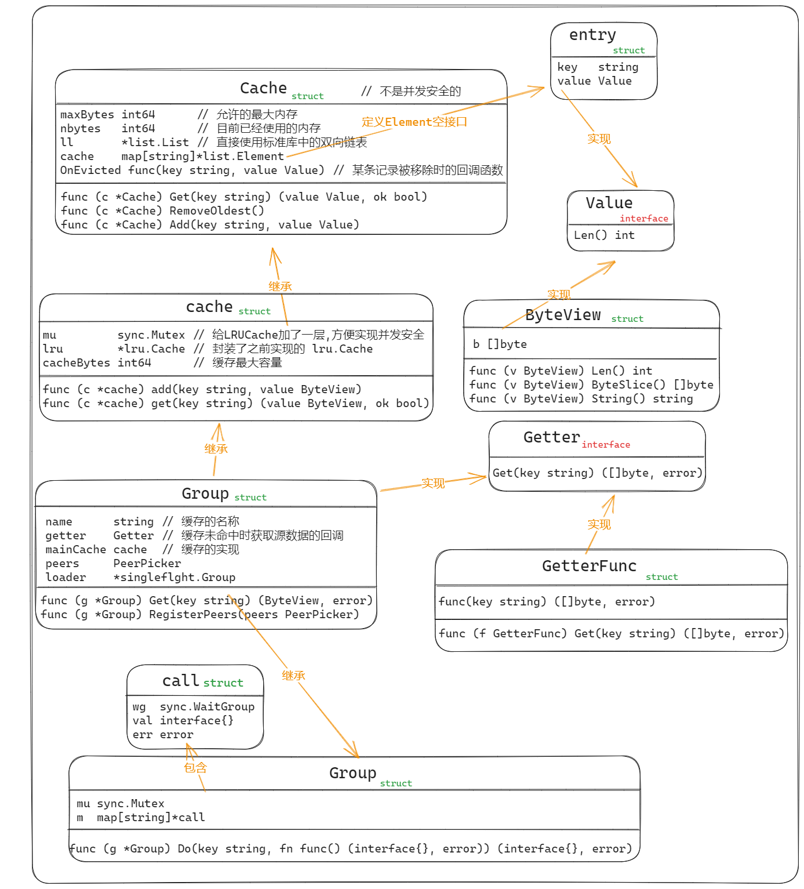

# minicache
效果展示:

开启了三个节点, 其中节点3也掌管分发作用


## 1 项目结构图

## 2 LRU 实现 Cache
Cache实现结构图
```go
// Cache v1 LRU缓存，不是并发安全的
type Cache struct {
	maxBytes int64      // 允许的最大内存
	nbytes   int64      // 目前已经使用的内存
	ll       *list.List // 直接使用标准库中的双向链表
	cache    map[string]*list.Element
	// 可选项在清除entry时执行
	OnEvicted func(key string, value Value) // 某条记录被移除时的回调函数
}
```
主要支持三个方法：
1. Get 查找功能
```go
func (c *Cache) Get(key string) (value Value, ok bool) {
	if ele, ok := c.cache[key]; ok {
		// 将此项移到队尾
		c.ll.MoveToBack(ele)
		// 拿到节点的信息返回
		kv := ele.Value.(*entry)
		return kv.value, true
	}
	return
}
```
2. RemoveOldest 删除最近最少访问的节点
```go
func (c *Cache) RemoveOldest() {
	// 取到队首节点
	ele := c.ll.Back()
	if ele != nil {
		c.ll.Remove(ele)
		kv := ele.Value.(*entry)
		delete(c.cache, kv.key)
		// 调整已经占用的内存
		c.nbytes -= int64(len(kv.key)) + int64(kv.value.Len())
		// 如果回调函数不为空, 则调用回调函数
		if c.OnEvicted != nil {
			c.OnEvicted(kv.key, kv.value)
		}
	}
}
```
3. Add 添加/修改功能
```go
func (c *Cache) Add(key string, value Value) {
	if ele, ok := c.cache[key]; ok {
		// 如果存在, 则更新值并将该节点移到队尾
		c.ll.MoveToBack(ele)
		kv := ele.Value.(*entry)
		// 更新内存占用
		c.nbytes += int64(value.Len()) - int64(kv.value.Len())
		// 更新节点的值
		kv.value = value
	} else {
		// 如果不存在, 则插入新节点
		ele := c.ll.PushFront(&entry{key, value})
		// 更新内存占用
		c.cache[key] = ele
		c.nbytes += int64(len(key)) + int64(value.Len())
	}
	// 如果超出了最大内存, 则移除最少访问的节点
	for c.maxBytes != 0 && c.nbytes > c.maxBytes {
		c.RemoveOldest()
	}
}
```
## 3 并发缓存
```go
// 一个并发安全的缓存结构
type cache struct {
	mu         sync.Mutex // 给LRUCache加了一层,方便实现并发安全
	lru        *lru.Cache // 封装了之前实现的 lru.Cache
	cacheBytes int64      // 缓存最大容量
}
```
在Cache的基础上加一把即可
## 4 一致性哈希
对于分布式节点，需要有一种选择节点和编排方式，这里采用的是一致性哈希来选择节点，将不同的数据存入对应的节点
```go
type Hash func(data []byte) uint32

type Map struct {
	hash     Hash   // 将数据进行哈希处理
	replicas int   // 虚拟节点的倍数
	keys     []int // 哈希环
	hashMap  map[int]string // 存放节点的map
}
```
### 4.2 New 创建 `Map` ，定义 `Map.Hash` 
使用了 `hash/crc32` 标准库中的 哈希处理函数 `crc32.ChecksumIEEE`
```go
func New(replicas int, fn Hash) *Map {
	m := &Map{
		replicas: replicas,
		hash:     fn,
		hashMap:  make(map[int]string),
	}
	if m.hash == nil {
		m.hash = crc32.ChecksumIEEE
	}
	return m
}
```
### 4.2 Add 添加节点
```go
func (m *Map) Add(keys ...string) {
	for _, key := range keys {
		// 添加虚拟节点
		for i := 0; i < m.replicas; i++ {
			hash := int(m.hash([]byte(strconv.Itoa(i) + key)))
			m.keys = append(m.keys, hash) // 把虚拟节点加入到哈希环当中
			m.hashMap[hash] = key         // 维护映射关系
		}
	}
	sort.Ints(m.keys)
}
```
### 4.3 Get 选择节点
使用 `sort` 标准库中的 `Search` 实现顺时针搜索
```go
func (m *Map) Get(key string) string {
	if len(m.keys) == 0 {
		return ""
	}
	// 获得key的哈希值
	hash := int(m.hash([]byte(key)))
	// 顺时针找到keys值大于哈希值的第一个虚拟节点
	idx := sort.Search(len(m.keys), func(i int) bool {
		return m.keys[i] >= hash
	})
	// 根据映射找到真实节点
	return m.hashMap[m.keys[idx%len(m.keys)]]
}
```
## 5 HTTP
```go
// HTTPPool 为 HTTP 节点实现了 PeerPicker。
type HTTPPool struct {
	// 基本 URL，例如“https://example.net:8000”
	self        string
	basePath    string
	mu          sync.Mutex // 保护 Peer 和 httpGetters
	peers       *consistenthash.Map
	httpGetters map[string]*httpGetter
}
```
### 5.1 `ServeHTTP` 处理HTTP请求
```go
func (p *HTTPPool) ServeHTTP(w http.ResponseWriter, r *http.Request) {
	// 前缀是否合法
	if !strings.HasPrefix(r.URL.Path, p.basePath) {
		panic("HTTPPool serving unexpected path: " + r.URL.Path)
	}
	p.Log("%s %s", r.Method, r.URL.Path)
	// /<basepath>/<groupname>/<key>
	// 把groupname和key进行拆分
	parts := strings.SplitN(r.URL.Path[len(p.basePath):], "/", 2)
	// 请求地址不合法
	if len(parts) != 2 {
		http.Error(w, "bad request", http.StatusBadRequest)
		return
	}
	// 得到 groupName 和 key
	groupName := parts[0]
	key := parts[1]
	// 根据名称拿到这个 group
	group := GetGroup(groupName)
	if group == nil {
		http.Error(w, "no such group: "+groupName, http.StatusNotFound)
		return
	}
	// 从group中得到value
	view, err := group.Get(key)
	if err != nil {
		http.Error(w, err.Error(), http.StatusInternalServerError)
		return
	}

	// 将结果通过proto的函数编码
	body, err := proto.Marshal(&pb.Response{Value: view.ByteSlice()})
	if err != nil {
		http.Error(w, err.Error(), http.StatusInternalServerError)
		return
	}
	// 加上Header
	w.Header().Set("Content-Type", "application/octet-stream")
	// 写回响应
	w.Write(body)
}
```
### 5.2 `PickPeer` 根据 key 选择节点
```go
func (p *HTTPPool) PickPeer(key string) (PeerGetter, bool) {
	p.mu.Lock()
	defer p.mu.Unlock()
	if peer := p.peers.Get(key); peer != "" && peer != p.self {
		p.Log("Pick peer %s", peer)
		return p.httpGetters[peer], true
	}
	return nil, false
}
```
### 5.3  `Get` Proto通信
```go
func (h *httpGetter) Get(in *pb.Request, out *pb.Response) error {
	// 构造了HTTP GET请求的URL
	u := fmt.Sprintf(
		"%v%v/%v",
		h.baseURL,
		url.QueryEscape(in.GetGroup()), // 经过了URL编码，以确保它们可以安全地包含在URL中
		url.QueryEscape(in.GetKey()),
	)
	// 发送HTTP GET请求
	res, err := http.Get(u)
	if err != nil {
		return err
	}
	defer res.Body.Close()

	if res.StatusCode != http.StatusOK {
		return fmt.Errorf("server returned: %v", res.Status)
	}

	bytes, err := ioutil.ReadAll(res.Body)
	if err != nil {
		return fmt.Errorf("reading response body: %v", err)
	}

	if err = proto.Unmarshal(bytes, out); err != nil {
		return fmt.Errorf("decoding response body: %v", err)
	}

	return nil
}
```
## 6 `Group` 节点封装

```go
// Group 一个并发安全的缓存结构
type Group struct {
	name      string // 缓存的名称
	getter    Getter // 缓存未命中时获取源数据的回调
	mainCache cache  // 缓存的实现, 在之前实现的缓存外套了一层name, 便于缓存不同类型的数据
	peers     PeerPicker
	loader    *singleflght.Group
}

```
### 6.1 `GetGroup` 返回指定名称的Group
```go
func GetGroup(name string) *Group {
	// 只用了读锁, 因为不涉及冲突变量的写操作
	mu.RLock()
	g := groups[name]
	mu.RUnlock()
	return g
}
```
### 6.2 `Get` 获得value流程
```go   
// Get 实现根据key获取内容的功能
func (g *Group) Get(key string) (ByteView, error) {
	// key值不能为空
	if key == "" {
		return ByteView{}, fmt.Errorf("key is required")
	}
	// 从缓存中获取数据
	if v, ok := g.mainCache.get(key); ok {
		log.Println("[GeeCache] hit")
		return v, nil
	}
	// 如果没有命中, 则调用load方法
	return g.load(key)
}

// load 实现缓存未命中时的回调函数
func (g *Group) load(key string) (value ByteView, err error) {
	// 每个密钥只被获取一次（本地或远程）。
	// 无论有多少并发调用者。
	viewi, err := g.loader.Do(key, func() (interface{}, error) {
		if g.peers != nil {
			if peer, ok := g.peers.PickPeer(key); ok {
				// 从其他节点获取缓存
				if value, err = g.getFromPeer(peer, key); err == nil {
					return value, nil
				}
				log.Println("[GeeCache] Failed to get from peer", err)
			}
		}
        // 其他节点也没找到, 从本地数据库拿去数据
		return g.getLocally(key)
	})

	if err == nil {
		return viewi.(ByteView), nil
	}
	return
}
// getLocally 实现缓存未命中时的回调函数
func (g *Group) getLocally(key string) (ByteView, error) {
    // 调用用户自定义的回调函数
    bytes, err := g.getter.Get(key)
    if err != nil {
        return ByteView{}, err
    }
    // 将获取到的数据封装成ByteView
    value := ByteView{b: cloneBytes(bytes)}
    // 将数据添加到缓存中
    g.populateCache(key, value)
    return value, nil
}
func (g *Group) getFromPeer(peer PeerGetter, key string) (ByteView, error) {
    req := &pb.Request{
        Group: g.name,
        Key:   key,
    }
    res := &pb.Response{}
    err := peer.Get(req, res)
    if err != nil {
        return ByteView{}, err  
    }
    return ByteView{b: res.Value}, nil
}
// populateCache 将数据添加到缓存中
func (g *Group) populateCache(key string, value ByteView) {
    g.mainCache.add(key, value)
}
```
大致流程为: 本地缓存 -> 其他节点缓存 -> 本地数据库 -> 加入本地数据库
## 7 防止缓存击穿
```go
type call struct {
	wg  sync.WaitGroup
	val interface{}
	err error
}

type Group struct {
	mu sync.Mutex
	m  map[string]*call
}

func (g *Group) Do(key string, fn func() (interface{}, error)) (interface{}, error) {
	g.mu.Lock()
	if g.m == nil {
		g.m = make(map[string]*call)
	}
	if c, ok := g.m[key]; ok {
		g.mu.Unlock()
		c.wg.Wait()
		return c.val, c.err
	}
	c := new(call)
	c.wg.Add(1)
	g.m[key] = c
	g.mu.Unlock()

	c.val, c.err = fn()
	c.wg.Done()

	g.mu.Lock()
	delete(g.m, key)
	g.mu.Unlock()

	return c.val, c.err
}
```
g.mu 是保护 Group 的成员变量 m 不被并发读写而加上的锁。为了便于理解 Do 函数，我们将 g.mu 暂时去掉。并且把 g.m 延迟初始化的部分去掉，延迟初始化的目的很简单，提高内存使用效率。

剩下的逻辑就很清晰了：
```go
func (g *Group) Do(key string, fn func() (interface{}, error)) (interface{}, error) {
    if c, ok := g.m[key]; ok {
        c.wg.Wait()   // 如果请求正在进行中，则等待
        return c.val, c.err  // 请求结束，返回结果
    }
    c := new(call)
    c.wg.Add(1)       // 发起请求前加锁
    g.m[key] = c      // 添加到 g.m，表明 key 已经有对应的请求在处理

	c.val, c.err = fn() // 调用 fn，发起请求
	c.wg.Done()         // 请求结束

    delete(g.m, key)    // 更新 g.m
    
	return c.val, c.err // 返回结果
}
```
